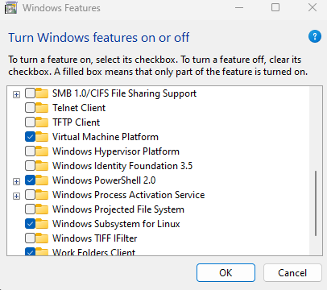
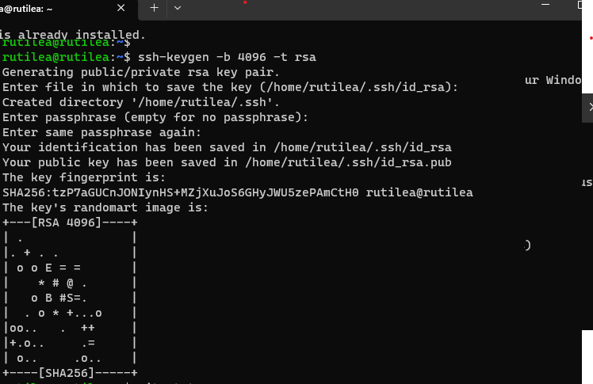

# Onboarding#1: Set-up New Windows Computer

To set up a new windows computer for a developer enviroment.
Make sure that you have registered the computer and logged in to the windows home directory.

## 1. Download Chrome 
It is advisable to use the chrome browser as 
- it provides you with alot of extensions that you will be able to use later. 
- Secondly it enables hardware acceleration in cases where you would be using some web apps that require hardware acceleration for nstance most video call apps like ```google meet``` or ```zoom```
- Thirdly, it is just fun to use (lol and popular too)
<<<[Download link](https://www.google.com/chrome/?brand=CHBD&brand=CHBD&gclid=EAIaIQobChMI_ZCO57S6gAMVIG0PAh3fnw6zEAAYASABEgLw8fD_BwE&gclsrc=aw.ds)>>>

## 2. Download IDE
1. Depending on your own preffered IDE you may decide to use VS Code.
It is advantaguos since. 
    - it support various extension to enable your coding life eassieri.e automated docstrings among others.
    - It is a light weight broser and therefore easier to run most of the code including compiling.
    - Easier installation of iPython therefore allowing you to easily run ```jupyter notebook``` cells.

Additionally you may also check out pycharm.
- Pycharma natively allows for quck formatting of code. i.e for python code according to PEP8 standards. 

## 3. Running Linux on Windows
You may already be used to a linux environment and since we are doing alot of matrix proxessing we need to utilize the gpu in most widows systems.

To get started you can be able to set up ```Windows Shell for Linux (WSL2)``` which allows you to run a unix os on windows using ang hypervisor. 
In order to conduct this you need to follow the following steps. 

To Get started.
1. Go to the Microsoft store and install ```Ubuntu 22.04.2``` 
2. Open the command line (cmd) as administrator.
    - To install WSL2 run ``wsl --install``. This default to isntalling an ubuntu distribution.
    - Note: Incase you need to use a different distribution from the 
    - Check the WSL version. At the moment the latest version is WSL2. TO check the version in the CMD type ```wsl --version```.
    - After theis steps update the wsl to update all the dependacies that might have come with the OS. Run ```wsl --update```.
3. For older OS you need to set up the windows feature for WSL. 
    - Go to the windows button and type ```Turn windows features on or off``` .
    - Select the ```Windows Subsytem for Linux```, tick on the check box and OK.
    - Restart the PC for the changes to take effect. 

3. After restarting the computer the following window appears when you open the ubuntu shell.
    - Enter the user name and the password when prompted by the unix shell. Remmember the password as you will need it in the unix as a ```sudo```.
    

## 4. Installing Pytorch on Ubuntu Environment
After installation of WSL2 you need to install pytorch on the new Ubuntu environment to allow pytorch to utilize the GPU.

In most cases some people may prefer using anaconda. Howerver, in my personal experience I find it broken at times and results in some conflict when running the CuDNN.

1. Confirm that you have python insrta;;es in your ubuntu  environment. On widows search ```Ubuntu``` and on the CLI type ```python3```.  To exit the interactive mode of the new python environment type ```exit()``` or the classic ```Crtl + C``` for keyboard interupt. 


    If Python is not available in the environment type.
    ```
    sudo apt install -y python3
    sudo apt install -y python3-pip
    ```
    In both cases, you will be promted to enter the ```password ``` and it is the right time to use the password earlier created on the unix enviroment
2. Once you have verified that python is installed in the Ubuntu environment. Lets start installing pytorch.

## 5. Setup github
To set up github use in the new computer it is advisable to use the SSH key rather than the normal https set credentials because it allows you to log in only once.
- First in the ubuntu terminal cd to the home file and run the command.
```
ssh-keygen -b 4096 -t rsa
```

- Login to github and set the ssh key to the 
When prompted to add the passwpor 
Notes: The -b 4096 byte allows you to set the set the length of you ssh key. You may also decide to use 2048 or any other preffered option.
- Get the 


## 7. Make python environment 
First install the and update python3

```sudo apt update
```